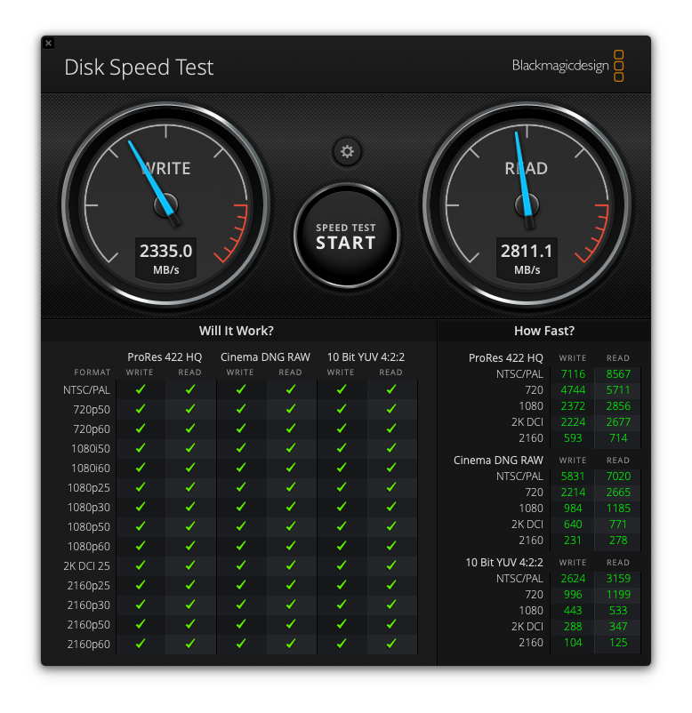

# macOS on Lenovo Thinkpad X1 Carbon Gen 8 (20U9)

OpenCore-based EFI for Lenovo Thinkpad X1 Carbon 8th Generation | Model 20U9


**Status: Stable | Daily driver**

[](https://www.apple.com/macos/monterey/)
[](https://support.apple.com/en-us/HT212585#macos122)
[](https://github.com/acidanthera/OpenCorePkg/releases/tag/0.7.7)
[](https://www.lenovo.com/us/en/p/laptops/thinkpad/thinkpadx1/x1-carbon-gen-8-/20u9005mus)

This repo is forked from several X1C7-Hackintosh repositories (See **OTHER REPOSITORIES**)

**DISCLAIMER:**
As you embark on your Hackintosh journey you are encouraged to **READ** the entire README and [Dortania](https://dortania.github.io/getting-started/) guides before you start.

This X1C8 Hackintosh project aims to be an all-in-one maintained hub for Opencore-based hackintoshes on the Thinkad X1 Carbon Gen 8. In short, this X1C8-Hackintosh is very stable and is currently my daily driver. I fully recommend this project to anyone looking for a MacBook alternative.

You can find a wealth of knowledge on [Reddit](https://www.reddit.com/r/hackintosh/), [TonyMacX86](https://www.tonymacx86.com) or [Google](https://www.google.com).

**Important:** If you are upgrading to macOS 14.4+ you have to set the value of `Misc -> Security -> SecureBootModel` to `Disabled` in config.plist and disable AirportItlwm kext untill the upgrade finishes and then use "AirportItlwm_v2.3.0_stable_Sonoma14.4.kext".

Should you find an error, or improve anything, be it in the config itself or in the my documentation, please consider opening an issue or a pull request to contribute.

**I am not responsible for any damages you may cause.**

## Summary

<details>  

<summary><strong>WORKING ✅</strong></summary>
<br>

> ### Video and Audio
| Feature                              | Status | Dependency          | Remarks                      |
| :----------------------------------- | ------ | ------------------- | ---------------------------- |
| Full Graphics Accleration (QE/CI) | ✅ | `WhateverGreen.kext` & `AAPL,ig-platform-id` = 0900A53E & `device-id` = C89B0000 | - |
| Audio Output | ✅ | `AppleALC.kext` with Layout ID = 71 | - |
| Audio Speakers | ✅ | `AppleALC.kext` with Layout ID = 71 | You have to manually aggregate the two output using "Audio MIDI Setup" to have 4 speakers working |
| Audio Input | ✅ | `AppleALC.kext` with Layout ID = 71 | Headset microphone is inconsistent and needs more testing |
| Automatic Headphone Output Switching | ✅ | `AppleALC.kext` with Layout ID = 71 | - |

> ### Power Management
| Feature                              | Status | Dependency          | Remarks                      |
| :----------------------------------- | ------ | ------------------- | ---------------------------- |
| Battery | ✅ | `ECEnabler.kext` | Battery life is native compared to Windows and Linux |
| CPU Power Management (SpeedShift) | ✅ | `CPUFriend.kext` with `CPUFriendDataProvider.kext` | - |
| iGPU Power Management | ✅ | `SSDT-PLUG.aml` | - |
| NVMe Drive Battery Management | ✅ | `NVMeFix.kext` | Improves NVMe drive power management |
| S3 Sleep / Hibernation Mode 3 | ✅ | - | - |

> ### Connectivity
| Feature                              | Status | Dependency          | Remarks                      |
| :----------------------------------- | ------ | ------------------- | ---------------------------- |
| WiFi | ✅ | `AirportIltwm.kext` | - |
| Bluetooth | ✅ | `IntelBluetoothFirmware.kext`, `BlueToolFixup.kext`, and `USBMap.kext` | Headset's microphone is not working via Bluetooth |
| Ethernet | ✅ | `IntelMausi.kext` | - |
| HDMI 1.4 | ✅ | BusID patching | It only works properly after being put to sleep and woken up once (Hotplug & 4K resolution are supported) |
| 1st USB-C (Display output) | ✅ | - | It only works properly after being put to sleep and woken up once (Hotplug & 4K resolution are supported) |
| 2nd USB-C (Display output) | ✅ | - | It works properly (Hotplug is supported) |
| USB 2.0 / USB 3.0 | ✅ | `USBMap.kext` | Create your own USBMap.kext using [CorpNewt](https://github.com/corpnewt/USBMap) |
| USB 3.1 (Type-C) | ✅ | `USBMap.kext` and enable Thunderbolt 3 in `BIOS` | Hotplug is working |
| USB Power Properties in macOS | ✅ | - | - |
| ThinkPad USB-C Docking Station | ✅ | - | Work smoothly |

> ### Display, TrackPad, TrackPoint, Keyboard, and Webcam
| Feature                              | Status | Dependency          | Remarks                      |
| :----------------------------------- | ------ | ------------------- | ---------------------------- |
| Brightness Adjustments | ✅ | `WhateverGreen.kext`, `SSDT-PNLF.aml`, `enable-backlight-smoother` property, and `BrightnessKeys.kext`| `enable-backlight-smoother` property is optional for smoother birghtness adjustments |
| TrackPoint | ✅ | `VoodooPS2Controller.kext` | - |
| TrackPad | ✅ | `VoodooI2C.kext` and `VoodooI2CHID.kext` | - |
| Built-in Keyboard | ✅ | `VoodooPS2Controller.kext` | - |
| Webcam | ✅ | `USBMap.kext` | - |


> ### macOS Continuity
| Feature                              | Status | Dependency          | Remarks                      |
| :----------------------------------- | ------ | ------------------- | ---------------------------- |
| iCloud, iMessage, FaceTime | ✅ | Whitelisted Apple ID, Valid SMBIOS See [Dortania / OpenCore-Install-Guide](https://dortania.github.io/OpenCore-Post-Install/universal/iservices.html) | Switch to itlwm.kext in order to work with macOS Sonoma |
| Sidecar (wired) | ✅ | - | Tested with iPad Pro M1 with USB-C to USB-C cable |

> ### Miscellaneous
| Feature                              | Status | Dependency          | Remarks                      |
| :----------------------------------- | ------ | ------------------- | ---------------------------- |
| Multiple Boot | ✅ | - | macOS, Windows, and Linux distributions (Use [this](https://dortania.github.io/OpenCore-Multiboot/empty/samedisk.html#precautions) guide to setup dual boot on the same drive) |
| Boot chime | ✅ | - | Working like a charme |
| Fan Control / Multimedia Keys | ✅ | `YogaSMC.kext` | I modified YogaSMC.kext in order to work with my setup |
| FireVault 2 | ✅ | - | Working but the keyboard layout during boot is messed up! |

</details>  

<details>  
<summary><strong>NOT WORKING ❌</strong></summary>
<br>

| Feature                              | Status | Dependency          | Remarks                      |
| :----------------------------------- | ------ | ------------------- | ---------------------------- |
| Fingerprint Reader | ❌ | - | Will never work |
| Wireless WAN | ❌ | `DISABLED` in BIOS to save power. | Unable to investigate as I have no need and my model did not come with WWAN |
| DRM | ❌ | iGPU | DRM is broken with iGPUs |
| Internal Microphone | ❌ | - | I hope it will work one day |
| Thunderbolt 3 | ❌ | - | Not working |
| Continuity Camera | ❌ | - | Not working with Intel wireless cards |
| AirDrop | ❌ | - | Not working with Intel wireless cards |
| Apple Watch Auto Unlock | ❌ | - | Not working with Intel wireless cards |
| Instant Hotspot | ❌ | - | Not working with Intel wireless cards |
| Sidecar (wireless) | ❌ | - | Not working with Intel wireless cards |
| Continuity Markup and Sketch | ❌ | - | Not working with Intel wireless cards |
| Handoff | ❌ | - | Support dropped with macOS Sonoma and the new AirportIltwm kext |
| Universal Clipboard | ❌ | - | Support dropped with macOS Sonoma and the new AirportIltwm kext |
| SMS & Phone Call via iPhone | ❌ | - | Support dropped with macOS Sonoma and the new AirportIltwm kext |
| AirPlay to Mac | ❌ | - | Support dropped with macOS Sonoma and the new AirportIltwm kext |

</details>  

## Introduction

<details> 
<summary><strong>THIS IS NOT A GUIDE!</strong></summary>
</br>

This is not a guide. It shoud only be used as a reference. I provide some tips and tricks I learned on my journey in building a hackintosh. The best way of using this is as a supplement to the OpenCore guide. If you have questions about how to setup your specific hardware, are unclear about what to do, or would like to see the settings I've used.

I understand that some may simply add the OC and Boot folders to their EFI folder. For clarity the EFI partition needs a folder called EFI that contains the Boot and OC folder.

```EFI
EFI (drive)
	EFI
	├── BOOT
	├── OC
```

It should work and your X1C8 should boot and work fine. **You will at minimum need to generate SMBIOS values if you want Apple services to work.** Note that all error reporting/logging has been turned off in the config.plist. You will have a difficult time trouble shooting with the setup provided. You can easily turn on the error reporting and logging if you follow the Dortania guide. Best of luck.

> **NOTE** if you simply wish to copy my EFI please do the following:
>
>1. [Generate SMBIOS values](https://dortania.github.io/OpenCore-Install-Guide/config-laptop.plist/coffee-lake-plus.html#nvram) and add them in the config.plist (Use MacBookAir9,1)
>2. Ensure the value of `showpicker` is  `true` in the config.plist file to provide the opencore menu when booting. 
>3. Prepare your install [USB](https://dortania.github.io/OpenCore-Install-Guide/installer-guide/)
>4. Move the entire EFI folder (with your modifications) to the proper partition on your [USB](https://dortania.github.io/OpenCore-Install-Guide/installer-guide/mac-install.html#setting-up-opencore-s-efi-environment) (or [SSD](https://dortania.github.io/OpenCore-Post-Install/universal/oc2hdd.html) once the install is complete).
>5. [Install](https://dortania.github.io/OpenCore-Install-Guide/installation/installation-process.html#double-checking-your-work) - You'll need to select F12 to get the boot menu options and **boot from the USB each time the computer restarts** until you've copied the EFI folder onto the hard drive. You may also need to select the correct boot option during install.

</details>  

<details> 
<summary><strong>THIS IS A GUIDE!</strong></summary>
</br>

**The one and only guide to install macOS, provided by [Dortania](https://dortania.github.io/OpenCore-Install-Guide/)**

</details>  

<details>
<summary><strong>HARDWARE</strong></summary>

### Lenovo ThinkPad X1 Carbon Gen 8 (Core i7)

These are relevant components on my machine which may differ from yours, keep these in mind as you will need to adjust accordingly, depending on your machine's configuration.

| Category  | Component                                       | Note                                                         |
| --------- | ----------------------------------------------- | ------------------------------------------------------------ |
| Type | 20U9 | - |
| CPU | Intel Core i7-10510U | - |
| GPU | Intel UHD Graphics | - |
| SSD | WDC PC SN720 SDAQNTW-512G-1001 | Swapped for better compatibility, the laptop came with a Toshiba SSD |
| Screen | 14" FHD - 1920 x 1080 | - |
| Memory | 8GB / 2133MHz LPDDR3 | - |
| Battery | Integrated Li-Polymer 51Wh | - |
| Camera | 720p Camera | - |
| Wi-Fi & BT | Intel Wi-Fi 6 AX201 | - |
| Input | PS2 Keyboard & Synaptics I2C HID TrackPad | - |
| Ports | 2x USB 3.1 Gen 1 (Right USB Always On)</br> 2x USB 3.1 Type-C Gen 2 / Thunderbolt 3 (Power Delivery and DisplayPort) [Max 5120x2880 @60Hz]</br> HDMI 1.4 (Max 4096x2160 @24Hz) | - |

Refer to [ThinkPad X1 Carbon Gen 8 Specs](https://psref.lenovo.com/syspool/Sys/PDF/ThinkPad/ThinkPad_X1_Carbon_Gen_8/ThinkPad_X1_Carbon_Gen_8_Spec.PDF) for possible stock configurations.

</details>  

<details>

<summary><strong>SOFTWARE</strong></summary>
<br>

| Component      | Version |
| -------------- | ------- |
| OpenCore | 1.0.0 |
| macOS Sonoma | 14.5 |
| Windows 11 | 23H2 |
| Ubuntu | 22.04.4 LTS |
| Fedora | 40 |

</details>

<details>
<summary><strong>ACPI</strong></summary>
<br>

| Component              |
| ---------------------- |
| SSDT-AWAC |
| SSDT-ECRW |
| SSDT-PLUG |
| SSDT-PNLF |
| SSDT-THINK |
| SSDT-USBX |
| SSDT-XOSI |

</details>

<details>
<summary><strong>KEXT</strong></summary>
<br>

| Kext                   | Version |
| ---------------------- | ------- |
| AirportItlwm | 2.3.0 |
| AppleALC | 1.9.0 |
| BlueToolFixup | 2.6.8 |
| BrightnessKeys | 1.0.3 |
| CPUFriend | 1.2.7 |
| CPUFriendDataProvider | - |
| ECEnabler | 1.0.4 |
| FeatureUnlock | 1.1.5 |
| IntelBluetoothFirmware | 2.4.0 |
| IntelBTPatcher | 2.4.0 |
| IntelMausi | 1.0.7 |
| Lilu | 1.6.7 |
| NVMeFix | 1.1.1 |
| SMCBatteryManager | 1.3.2 |
| SMCProcessor | 1.3.2 |
| SMCSuperIO | 1.3.2 |
| USBMap | - |
| VirtualSMC | 1.3.2 |
| VoodooI2C | 2.8.0 |
| VoodooI2CHID | 2.8.0 |
| VoodooPS2Controller | 2.3.5 |
| WhateverGreen | 1.6.6 |
| YogaSMC | Modified version 1.5.1 |

</details>

<details><summary><strong>UEFI DRIVERS</strong></summary>
<br>

|     Driver      | Version           |
| --------------- | ----------------- |
| OpenCanopy.efi | OpenCorePkg 1.0.0 |
| OpenHfsPlus.efi | OpenCorePkg 1.0.0 |
| OpenRuntime.efi | OpenCorePkg 1.0.0 |
| AudioDxe.efi | OpenCorePkg 1.0.0 |
| CrScreenshotDxe.efi | OpenCorePkg 1.0.0 |
| Ext4Dxe.efi | OpenCorePkg 1.0.0 |
| OpenLinuxBoot.efi | OpenCorePkg 1.0.0 |
| ResetNvramEntry.efi | OpenCorePkg 1.0.0 |
| ToggleSipEntry.efi | OpenCorePkg 1.0.0 |

</details>

<details>
<summary><strong>OTHER REPOSITORIES</strong></summary>
<br>

- X1C7-Hackintosh repositories:
  - [suhrmann/x1c7-hackintosh](https://github.com/suhrmann/x1c7-hackintosh)
  - [aidanchandra/x1c7-hackintosh](https://github.com/aidanchandra/x1c7-hackintosh)
  - [seven-of-eleven/Lenovo-ThinkPad-X1C7-OC-Hackintosh](https://github.com/seven-of-eleven/Lenovo-ThinkPad-X1C7-OC-Hackintosh)
  - [huyhoang8398/x1c7-hackintosh-20R1](https://github.com/huyhoang8398/x1c7-hackintosh-20R1)
  - [EequalsMCsquare/ThinkPad-X1C7-OpenCore](https://github.com/EequalsMCsquare/ThinkPad-X1C7-OpenCore)
	
- X1C6-Hackintosh repositories:
  - [tylernguyen/x1c6-hackintosh](https://github.com/tylernguyen/x1c6-hackintosh)
  - [benbender/x1c6-hackintosh](https://github.com/benbender/x1c6-hackintosh)
  - [zhtengw/EFI-for-X1C6-hackintosh](https://github.com/zhtengw/EFI-for-X1C6-hackintosh)

</details>  

<details> 
<summary><strong>CREDITS</strong></summary>

### Credit to all these great people whom I don't know but have made my hackintosh dreams a reality:

- The guys from [Acidanthera](https://github.com/acidanthera) that make this possible
- [ben9923](https://github.com/ben9923) for [VoodooI2C](https://github.com/VoodooI2C/VoodooI2C)
- [Apple](http://apple.com) for macOS
- [CorpNewt](https://github.com/corpnewt) for [USBMap](https://github.com/corpnewt/USBMap) and [CPUFriendDataProvider](https://github.com/corpnewt/CPUFriendFriend)
- [headkaze](https://github.com/headkaze) for [Hackintool](https://github.com/headkaze/Hackintool)
- [Mieze](https://github.com/Mieze) for [IntelMausiEthernet](https://github.com/Mieze/IntelMausiEthernet)
- [OpenIntelWireless](https://github.com/OpenIntelWireless/IntelBluetoothFirmware/releases) for [IntelBluetoothFirmware](https://github.com/OpenIntelWireless/IntelBluetoothFirmware), [itlwm](https://github.com/OpenIntelWireless/itlwm) and [HeliPort](hhttps://github.com/OpenIntelWireless/HeliPort)
- People at [r/hackintosh](https://www.reddit.com/r/hackintosh/) for their advice and help
- And every other contributor

</details>  

<details><summary><strong>SCREENSHOTS</strong></summary>
    <br>
    <p float="left">
        
	
	
	
    </p>
</details> 

## Before Installation

<details><summary><strong>UEFI SETTINGS</strong></summary>
<br>
	
**Config**

- **Keyboard/Mouse**
  - `Trackpoint` **Enabled**
  - `Trackpad` **Enabled**
- **Display**
  - `Boot Display Device` **ThinkPad LCD**
  - `Total Graphics Memory` **512MB**
  - `Boot Time Extension` **Disabled**
- **CPU**
  - `Intel Hyper-Threading Technology` **Enabled**
- **Thunderbolt**
  - `Thunderbolt BIOS Assist Mode` **Disabled**
  - `Security Level` **No Security**
  - `Support in Pre Boot Environment -> Thunderbolt(TM) device` **Disabled**

**Security**

- **Memory Protection**
  - `Execution Prevention` **Enabled**
- **Virtualization**
  - `Kernel DMA Protection` **Disabled**
  - `Intel Virtualization Technology` **Enabled**
  - `Intel VT-d Feature` **Disabled**
  - `Enhanced Windows Biometric Security` **Disabled**
- **I/O Port Access**
  - `Wireless WAN` **Disabled**
- **Secure Boot**
  - `Secure Boot` **Disabled**
- **Intel SGX**
  - `Intel SGX Control` **Disabled**
- **Device Guard**
  - `Device Guard` **Disabled**

**Startup**

- `UEFI/Legacy Boot` **UEFI Only**
- `CSM Support` **No**
- `Boot Mode` **Quick**

</details>  

<details><summary><strong>KEYBOARD LAYOUT</strong></summary>
<br>

Either add as a `String` or as a `Data` (HEX Data [ProperTree](https://github.com/corpnewt/ProperTree))

Format is lang-COUNTRY:keyboard

🇺🇸 | [0] en_US - U.S --> en-US:0 --> (656e2d55 533a30 in HEX)

| Key           | Type   | Value   |
| ------------- | ------ | ------- |
| prev-lang:kbd | String | en-US:0 |


Pick your keyboard layout here:

[AppleKeyboardLayouts.txt](https://github.com/acidanthera/OpenCorePkg/blob/master/Utilities/AppleKeyboardLayouts/AppleKeyboardLayouts.txt)

</details>

## Post-Install

<details><summary><strong>TRACKPAD</strong></summary>
<br>

To improve the Trackpad in macOS, you have to disable `Force Click and haptic feedback` in `System Preferences -> Trackpad`

</details>  

<details><summary><strong>SMBIOS</strong></summary>
<br>

Use [GenSMBIOS](https://github.com/corpnewt/GenSMBIOS) to create your own serial # based off of your preferred model.

- MacBookPro16,3 -`What I used`
- MacBookPro16,2 -`Used by others`

**Note:** If you use a different SMBIOS model than the MacbookPro16,3 that I've used. The provided USB mapping will not work.  You will need to edit the `USBMap.kext` file.  You can right click on the file and select **Show Package Contents**.  From there you can open the Info.plist file in ProperTree and change MacBookPro16,3 to whatever Model ID you've chosen. This should provide a working USBMap.kext.

</details> 

<details>  
<summary><strong>POWER MANAGEMENT</strong></summary>
<br>

Generate CPUFriendDataProvider for your machine [here](https://github.com/fewtarius/CPUFriendFriend) or use those I've provided. Highly recommended that you use power management.

</details>

<details>  
<summary><strong>AUDIO</strong></summary>
<br>

Using the Layout ID 71 will enable the 4 speakers (Top front & Bottom rear) in **System Preferences>Sound** allowing you to select either set of speakers (Two Output). To combine the two you'll need to open Audio MIDI Setup and create `Multi-Output Device` with both sets of speakers. Unfortunately you can't control natively the volume of an Aggregate Device with the volume keys. You'll need to install [AggregateVolumeMenu](https://github.com/adaskar/AggregateVolumeMenu)

</details>

<details>  
<summary><strong>MISCELLANEOUS</strong></summary>
<br>

Download YogaSMC App [here](https://github.com/zhen-zen/YogaSMC/releases) to complete the Fan Control / Multimedia Keys setup.

</details>
